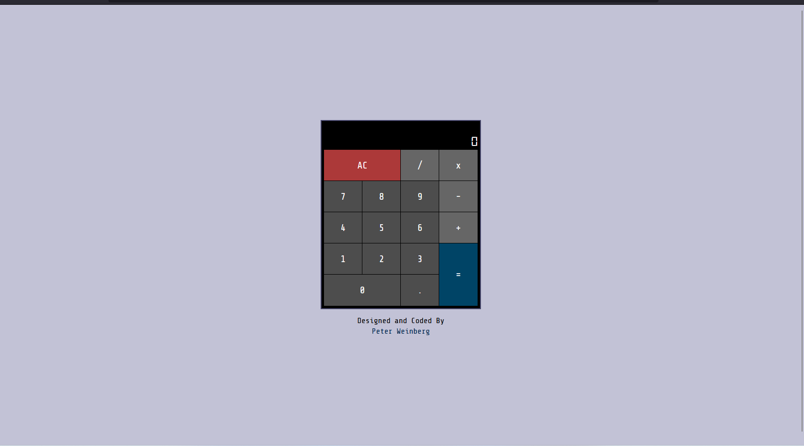

# JavaScript Calculator

> Design idea.

## Description
> A Svelte-based calculator app that fulfills the FreeCodeCamp Front End Libraries project requirements. It provides a fully functional calculator with a responsive design and follows the specified user stories.

## Features
- Clickable elements for numbers 0-9.
- Clickable elements for basic mathematical operators: add, subtract, multiply, divide.
- Clickable element for a decimal point.
- Clickable element for clearing the input and output values.
- Display element to show input and output values.
- Precision rounding for decimal calculations.
- Immediate execution logic for order of operation precedence.
- Responsive design.

## Tech Stack

## Usage
1. Click the numbers (0-9) to input values.
2. Use the operators (+, -, *, /) to perform calculations.
3. Click the decimal point for decimal calculations.
4. Use the "Clear" button to reset the calculator to its initialized state.
5. The result will be displayed in the element with the id of "display."

